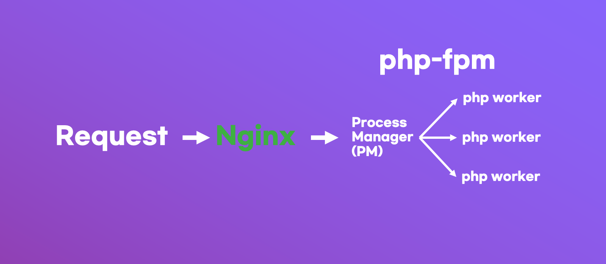

# Race Condition 이란?

레이스 컨디션(`Race Condition`)이란 컴퓨터는 워낙 빠르기고 분산되어 처리되기에 동시에 하나의 데이터를 수정하려고 할 때 발생하는 문제입니다.

### PHP는 싱글 스레드 아닌가요?

PHP는 싱글 스레드로 동작하지만, php-fpm 으로 여러 php 프로세스를 띄워놓고, nginx 를 통해 데이터를 전송하는 과정으로 서비스가 제공됩니다.



이미지 처럼 요청이 nginx 에서 fpm 내부의 `process manager`를 통해 `php worker` 처리되기에 동시에 여러 처리가 가능합니다.

하지만 이때 같은 처리를 하는 Request 가 동시에 2번 오게 된다면, 그때 `Race Condition`이 발생합니다.

## 테스트

### 환경

`레이스 컨디션`은 동시에 IO를 사용하면서 발생하기에, `php artisan serve` 는 싱글 스레드 상에서 돌아가기에 `레이스 컨디션`이 발생하지 않습니다!

그래서 번거롭더라도 `nginx + fpm` 과 같은 실제 서비스 환경과 유사한 환경을 갖춰야합니다.

#### 그래서 테스트 환경을 docker 로 구성해 놓았습니다! 

Github: [simple-laravel-race-condition-test](https://github.com/silnex/simple-laravel-race-condition-test)

---

### 코드

이번 테스트에 사용할 환경은 다음과 같습니다.

#### User 모델
```php
class User extends Model
{
    protected $fillable = ['id', 'name', 'balance'];
}
```

## Race Start!

특정 페이지에 접속하면 User의 money 가 1씩 올라가는 페이지가 있다고 해봅시다.

그럴 때 대게 아래와 같이 구현하게 됩니다.

## 1번째 방법

```php
$user->money += 1;
$user->save();
```

하지만 문제는 `$user->save()`가 완료되기 전에, 다음 요청이 들어오게 된다면 `$user->money` 값은 +1 하기 전의 값이기에 +1 이 한 번만 적용 되게 됩니다.  
~~문의: 계좌에 돈이 사라졌어요~~

이를 방지하기 위해선 `Pessimistic Lock` 을 사용해야 합니다.

## 2번째 방법: Pessimistic Lock

```php
$user->lockForUpdate()->first();
$user->money += 1;
$user->save();
```

`lockForUpdate()`를 사용하면, 해당 쿼리가 완료될 때까지 다른 쿼리가 해당 데이터를 수정할 수 없게 됩니다.

하지만 이 방법은 Lock이 되는동안 다른 프로세스가 대기하기에 성능 저하를 가져옵니다.

## 3번째 방법: Atomic Update

```php
$user->update(['money' => DB::raw('money + 1')]);
```

원자(Atomic) 업데이트를 하게 되면, 아래와 같이 실제 쿼리가 동작하게 됩니다.
```SQL
UPDATE `users` SET `money` = `money` + 1 WHERE `id` = 1
```

이렇게 처리되면, 해당 쿼리가 끝나기 전까지 `money`를 다른 쿼리에서 수정할 수 없고, 하나의 쿼리로 동작하기에 `Pessimistic Lock` 보다 성능이 좋습니다.

# 테스트 결과

[simple-laravel-race-condition-test](https://github.com/silnex/simple-laravel-race-condition-test) 프로젝트로 테스트한 결과를 보면 그 차이가 좀 더 두드러집니다.

### 방법 1: 레이스 컨디션 발생
```php
$user->update(['money' => $user->money + 1]);
/* Result
| 328 requests in 10.02s, 401.20KB read
| Requests/sec:     32.73
| user money: 252 
| Have Race Condition issue!
*/
```
`328` 개의 요청이 전달됬지만, 데이터는 `252` 만 들어가 76개의 요청이 사라졌습니다.  

### 방법 2: DB Lock 사용

```php
$user = $user->lockForUpdate()->find(1);
$user->update(['money' => $user->money + 1]);
/* Result
| 305 requests in 10.02s, 373.10KB read
| Requests/sec:     30.45
| User money: 315 (requests+10 because wrk run 10s+0.02s)
| Prevent Race Condition but slow down
*/
```

2번째 방법에선 lock 을 이용해 데이터 유실은 없었지만, Lock 이 없는 상태의 초당 요청이 `32.73`개 에서 `30.45` 으로 약 7%의 성능 하락이 있습니다.


### 방법 3: Atomic Update 사용

```php
$user->update(['money' => DB::raw('money + 1')]); // same this `$user->increment('money', 1);`
/* Result
| 333 requests in 10.02s, 407.36KB read
| Requests/sec:     33.22
| User money: 343 (requests+10 because wrk run 10s+0.02s)
| Prevent Race Condition and Fast!
*/
```

마지막으로 이번 글의 주제인 `Atomic Update` 를 사용하면, 기존과 성능은 동일하면서, 레이스컨디션은 막을 수 있습니다!

## 결론

기존에는 Redis/Memcached 를 사용했습니다만, 그럴수 없는 상황에서 여러가지 테스트 중에 나름 큰 성능 차이가 난다고 생각해 정리해 보았습니다.  
또 어느정도 명확히 가능한 상황이 제한적이지만, 그 상황이 맞다면 조금의 수정만으로 성능상의 이점을 누릴 수 있었습니다.

다만 레이스 컨디션 자체가 실제 환경과 유사한 환경을 구축 해야 되다보니, valet 을 사용했었는데, 글 작성중에 직접 테스트 할 수 있는 방법을 고민하다 docker 로 했습니다.

다만 valet 보다 성능이 더 떨어지다보니, 실제 서비스에선 성능상의 차이가 더 클 수 도 있습니다

# 마치며

바쁜 일정에 졸린 정신으로 글을 쓰니 안그래도 중구난방인 글이 더 중구 난방이 되는것같네요ㅎㅎ..