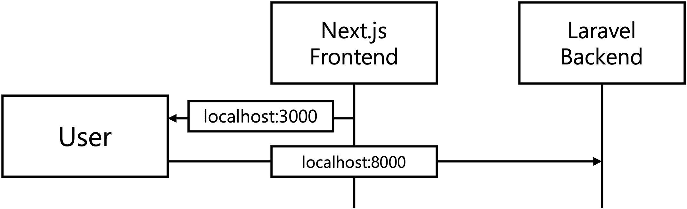
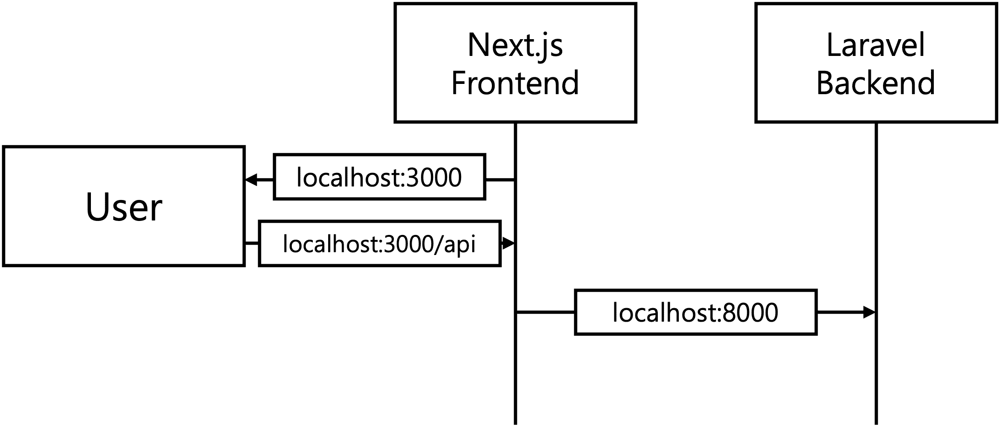
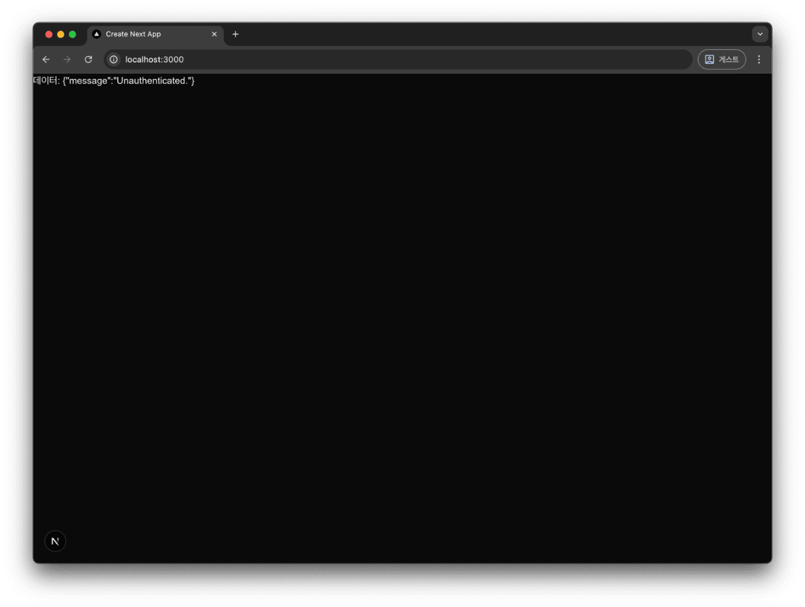
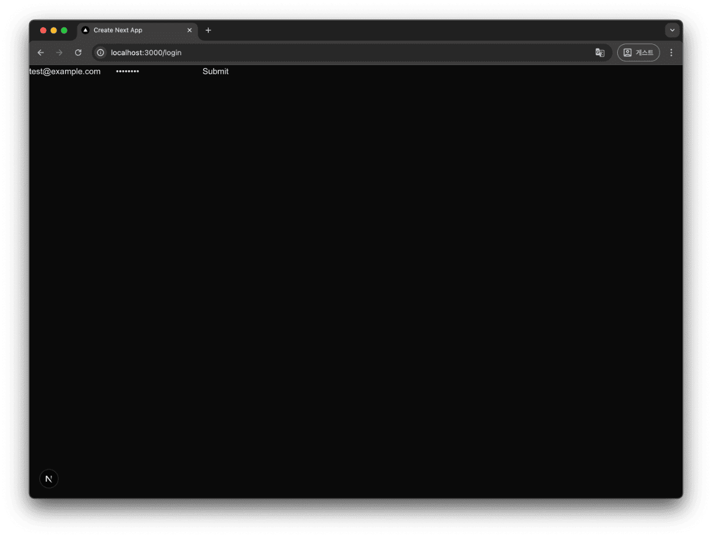
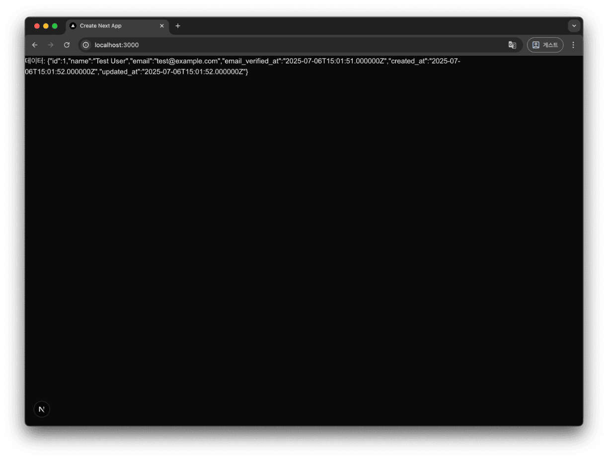

# Laravel과 Next.js 연동

Laravel의 [StartKit](https://laravel.com/starter-kits) 을 통해 Breeze 및 Sanctum 을 이용해 쉽게 연결하는 방법들이 생겼습니다.

하지만 Laravel 과 Next.js 이 하나의 앱처럼 동작하는 상황에서 API 토큰 DB 테이블, 토큰 만료 관리 등  
과도한 엔지니어링이 적용되는 것 같아 그런 구현 없이 Cookie 와 Session 만으로 Laravel 과 Next.js 를 구현하는 방법을 알아보려고 합니다.

# 구현 방법

Laravel 과 Next.js 를 세션만으로 연동 할 때 2가지 방법이 있는데, 각각 서로 차이가 있습니다.

<span id="method-1"></span>

#### Next.js 에서 별다른 처리를 하지 않고, 바로 Laravel 서버로 요청하는 방식



- Next.js 에서 그대로 Laravel 서버의 API 로 전달하면 되기에 구현이 단순하고 Next.js 서버에 부하가 적다
- 쿠키 설정에 SameSite Lax(기본값)인 경우 메인 도메인이 같거나,  
   None 인 경우 https(secure)를 사용하는 경우에만 브라우저에서 쿠키를 사용한다.
- CORS 설정과 이해가 필요하다.

<span id="method-2"></span>

#### Next.js 에서 Route Handler 를 통해 Next.js 이 중간에 요청을 받아 Laravel 로 전달하는 방식



- Next.js 에서 전달하기에 CORS, 쿠키 정책 설정 없이도 Laravel API 를 호출할 수 있다.
- Next.js 서버에 부하 발생할 수 있고, 요청이 Next.js 를 거쳐서 오기 때문에 느려질 수 있다.

이번 글에선 **방법 1** 으로 먼저 구성 후 **방법 2** 로 변경해보겠습니다.

---

# Laravel 세팅

## Cookie 정책 설정

```bash
# .env
SESSION_SAME_SITE=none
SESSION_SECURE_COOKIE=true # Secure 옵션은 https, localhost 에서만 적용됨
```

서로 도메인이 다른 경우 Cookie가 제대로 전달되기 위해선

- SESSION_SAME_SITE 로 SameSite 설정을 None 으로 설정
- SESSION_SECURE_COOKIE 로 Secure 설정을 활성화

## CORS 설정

```php
// config/cors.php
return [
    'paths' => ['api/*'], // api 경로로 오는 경로의 경로에서만 CORS 헤더를 포함
    // ...
    'allowed_origins' => ['http://localhost:3000'], // CORS 를 허용할 origin(schema+ host+port) 설정
    // ...
    'supports_credentials' => true, // 쿠키를 사용하기 위해 true 설정
];
```

## CSRF 라우터 설정

POST/PUT/PATCH/DELETE 등 요청 시 CSRF 토큰을 검증하기 위해 CSRF 라우터를 설정합니다.

```php
// routes/web.php
Route::get('/api/v1/csrf-token', function () {
    return csrf_token();
})->name('csrf-token');
```

## Login 및 User 정보 API 설정

로그인 기능과 User 정보를 반환 하는 API Endpoint 를 추가합니다.

### Router

```php
// routes/web.php
Route::post('/api/v1/login', [AuthenticateController::class, 'login'])
    ->name('auth.login');

Route::middleware('auth')->group(function () {
    Route::delete('/api/v1/logout', [AuthenticateController::class, 'logout'])
        ->name('auth.logout');

    Route::get('/api/v1/user/me', function (Request $request) {
        return $request->user();
    })->name('user.me');
});
```

### Controller

> `login` 라우터는 `guest` 미들웨어를 쓰지 않고, login 안에서 로그인 여부를 확인하는데,  
> 이는 `guest` 미들웨어는 이미 로그인 되었을 시 API 요청도 자동으로 `home` 또는 `dashboard` 로 리다이렉트 하기 때문에 이를 별도의 JSON 응답으로 바꾸기 위해 login 메소드 안에서 직접 처리합니다.

```php
// app/Http/Controllers/Api/AuthenticateController.php
class AuthenticateController extends Controller
{
    public function login(Request $request): JsonResponse
    {
        $credentials = $request->validate([
            'email' => ['required', 'email'],
            'password' => ['required'],
        ]);

        if ($request->user()) {
            return response()->json(['message' => '이미 로그인되어 있습니다.'], 201);
        }

        if (Auth::attempt($credentials)) {
            $request->session()->regenerate();

            return response()->json(['message' => '로그인 성공']);
        }

        return response()->json(['message' => '로그인 실패'], 401);
    }

    public function logout(): JsonResponse
    {
        Auth::logout();

        return response()->json(['message' => '로그아웃 성공']);
    }
}
```

# Next.js 세팅

## API URL 설정

```bash
NEXT_PUBLIC_API_URL=http://localhost:8000/api/v1
```

## 로그인 Form

```tsx
// app/login/page.tsx
"use client";

import { redirect } from "next/navigation";
import { FormEvent } from "react";

export default function LoginPage() {
  return (
    <div>
      <form onSubmit={handleSubmit}>
        <input type="text" name="email" defaultValue="test@example.com" />
        <input type="password" name="password" defaultValue="password" />
        <button type="submit">Submit</button>
      </form>
    </div>
  );
}

const handleSubmit = async (event: FormEvent<HTMLFormElement>) => {
  event.preventDefault();
  const currentTarget = event.currentTarget;

  // csrf token
  const tokenRes = await fetch(
    `${process.env.NEXT_PUBLIC_API_URL}/csrf-token`,
    {
      credentials: "include",
      headers: { "X-Requested-With": "XMLHttpRequest" },
    }
  );
  const csrfToken = await tokenRes.text();

  const formData = new FormData(currentTarget);
  const email = formData.get("email");
  const password = formData.get("password");

  const response = await fetch(
    `${process.env.NEXT_PUBLIC_API_URL}/api/front/v1/login`,
    {
      method: "POST",
      body: JSON.stringify({ email, password }),
      headers: {
        "X-CSRF-TOKEN": csrfToken,
        "X-Requested-With": "XMLHttpRequest",
      },
      credentials: "include",
    }
  );

  if (!response.ok) {
    console.error("Failed to submit form:", response.statusText);
    return;
  }

  redirect("/");
};
```

`handleSubmit` 함수의 플로우는

1. 먼저 `/csrf-token` API를 `credentials: "include"` 옵션과 함께 호출해 CSRF_TOKEN 와 Cookie(세션) 정보를 받아 옵니다.
   `"X-Requested-With": "XMLHttpRequest",` 는 fetch 를 통한 AJAX 호출임을 알리기 위해 추가한 헤더입니다.
2. 받은 CSRF_TOKEN과 브라우저가 자동으로 저장한 Cookie(세션) 정보와 함께 login API 로 전달합니다.
3. 로그인 성공시 "/" 경로로 리다이렉트 합니다.

## 메인("/") 페이지

사용자가 접속하면 `/user/me` API 를 호출해 응답값을 표시해주는 간단한 페이지입니다.

```tsx
// app/page.tsx
"use client";

import { Dispatch, useEffect, useState } from "react";

async function getUser(setUser: Dispatch<any>) {
  try {
    const response = await fetch(
      `${process.env.NEXT_PUBLIC_API_URL}/user/me`
      {
        credentials: "include",
        headers: { "X-Requested-With": "XMLHttpRequest" },
      }
    );

    const userData = await response.json();

    setUser(userData);
  } catch (error) {
    console.error("데이터 호출중 오류", error);
  }
}

export default function LoginPage() {
  const [user, setUser] = useState(false as any);

  useEffect(() => {
    getUser(setUser);
  }, []);

  return (
    <div>
      {user ? <p>데이터: {JSON.stringify(user)}</p> : <p>데이터 로딩 중...</p>}
    </div>
  );
}
```

---

# 테스트

## 서버 실행

```bash
# Laravel
php artisan serve

# Next.js
bun run dev # or npm run dev
```

라라벨과 Next.js 서버를 실행하면 8000, 3000 으로 각각 기본 포트로 실행됩니다.

### 메인 페이지

http://localhost:3000/ 에 접속하면 로그인 안된 상테이기에 `Unauthenticated` 메시지가 표시됩니다.



### 로그인



http://localhost:3000/login 에 접속해 로그인을 시도하면, 정상적으로 "/" 페이지로 이동된 후 유저 정보를 불러오는것을 볼수 있습니다



---

# 방법 2: Next 에서 Route Handler 를 통해 작업 하는 법

## Laravel 설정

기존의 설정을 유지해도 되지만, Next.js 를 통해 전달되는 방식이기 때문에 Cookie 보안 설정과 CORS 설정을 간결하게 할 수 있습니다.

```bash
# .env
#SESSION_SAME_SITE=none
#SESSION_SECURE_COOKIE=true
```

```bash
rm backend/config/cors.php
```

Next.js 와 API 호출을 하는 Origin 이 `http://localhost:3000` 이기에

- `.env` 에 `SESSION_SECURE_COOKIE`, `SESSION_SAME_SITE` 설정이 불필요 합니다.
- `config/cors.php` 설정 불필요

## Next.js 설정

### API URL 설정

```bash
API_URL=http://localhost:8000/api/v1
NEXT_PUBLIC_API_URL=http://localhost:3000/api
```

`API_URL` 로 Next.js 가 서버에서만 env 변수를 읽을 수 있도록 설정합니다.

### Route Handler

```ts
// app/api/[...path]/route.ts
import { NextRequest } from "next/server";

async function handleRequest(
  request: NextRequest,
  { params }: { params: { path: string[] } }
) {
  const searchParams = request.nextUrl.searchParams;
  const apiPath = (await params).path.join("/");

  const reqHeaders = request.headers;
  reqHeaders.append("X-Requested-With", "XMLHttpRequest");
  reqHeaders.append("Content-Type", "application/json");
  reqHeaders.append("Accept", "application/json");

  const res = await fetch(
    `${process.env.API_URL}/${apiPath}?${searchParams.toString()}`,
    {
      method: request.method,
      headers: reqHeaders,
      body: request.body,
      credentials: "include",
      duplex: "half", // 중복 요청 방지
    } as RequestInit & { duplex: string }
  );

  // 응답 헤더 복사 (쿠키 포함)
  return new Response(res.body, {
    headers: res.headers,
    status: res.status,
    statusText: res.statusText,
  });
}

export const GET = handleRequest;
export const POST = handleRequest;
```

이 Route Handler 는 Next.js 의 API 라우터로, 모든 API 요청을 받아서 Laravel 서버로 전달합니다.

- `params` 는 URL 경로를 배열로 받아서, `/api/v1/login` 같은 경로를 `API_URL` 뒤에 붙여서 Laravel API로 전달합니다.
- `searchParams` 는 URL 쿼리 파라미터를 가져와서, Laravel API로 전달합니다.
- `reqHeaders` 는 요청 헤더를 가져와서, Laravel API로 전달합니다.
  `X-Requested-With`, `Content-Type`, `Accept` 헤더를 추가하여 Laravel API가 AJAX 요청임을 인식할 수 있도록 합니다.
- `fetch` 를 통해 Laravel API로 요청을 보내고, 응답을 받아옵니다.
- `new Response` 를 통해 Laravel API의 응답을 그대로 반환합니다.

### 컴포넌트 수정

```tsx
// app/page.tsx
async function getUser(setUser: Dispatch<any>) {
  // ...
  const response = await fetch(`${process.env.NEXT_PUBLIC_APP_URL}/user/me`);
  // ...
}

// app/login/page.tsx

const handleSubmit = async (event: FormEvent<HTMLFormElement>) => {
  // ...
  const tokenRes = await fetch(`${process.env.NEXT_PUBLIC_APP_URL}/csrf-token`);
  // ...
  const response = await fetch(`${process.env.NEXT_PUBLIC_APP_URL}/login`, {
    method: "POST",
    body: JSON.stringify({ email, password }),
    headers: {
      "X-CSRF-TOKEN": csrfToken,
    },
  });
  // ...
};
```

fetch 요청을 할 대 Route Handler 에서 필요한 header 와 cookie 정보를 자동으로 추가해 전달해주기에 csrf-token 만 헤더에 추가해주면 됩니다.

이렇게 수정한 후 [테스트](#테스트) 를 진행하면, 동일하게 작동하는 것을 확인할 수 있습니다.

# 마무리

다들 "Cookie 와 Session 으로도 Next.js 와 Laravel 로그인 기능은 연동할 수 있다." 라고만 말하고 실제 구현을 소개 하는 예제는 거이 없다 싶이해 이번 글을 작성했습니다.

기존에 알려진 Breeze, Sanctum 을 이용한 방법과는 다르게, Cookie 와 Session 만으로 하는 경우 CORS 의 영향을 크게 받고 SameSite, Secure, Cookie domain 과 같은 영향을 크게 받는데, 그러다보니 단순하다고 이야기 하는 것에 비해 상당히 까다로웠네요;;

그리고 소개 하지 않은 방법이 있는데, CSRF 토큰을 따로 받는게 아니라 Set-Cookie 로 전달되는 `X-XSRF-TOKEN` 값을 헤더에 넣어 보내는 방법이 있습니다. 이 경우 브라우저에서 쿠키를 읽어와야하는데,  
**방법 1** 과 같이 도메인 이 다른 경우엔 사용이 쉽지 않고 sub-domain 을 사용한다고 해도 `SESSION_DOMAIN` 설정을 하고, cookie 값을 공유해서 브라우저에서 읽어와 header에 다시 넣고 하는 과정이 너무 복잡해 제외 했습니다. ~~(blade 로 하면 그냥 하면되는데..)~~

그나마 **방법 2** 같은 경우는 1 에 비해 쉽긴 하나, 결국 X-XSRF-TOKEN 값을 한번은 가져와야 하기에 실제 서비스 상에서 이동이 많은 경우를 제외하곤 큰 메리트가 없어 보이긴합니다. ~~(막상 케이스를 생각해보면 쓸만 할지도..)~~

### 마무리 잡지식

> 라라벨에서 `X-XSRF-TOKEN` 헤더는 암호화된 CSRF 토큰 값을 담고 `X-CSRF-TOKEN` 엔 CSRF 토큰의 평문을 넣어서 사용할 수 있답니다
