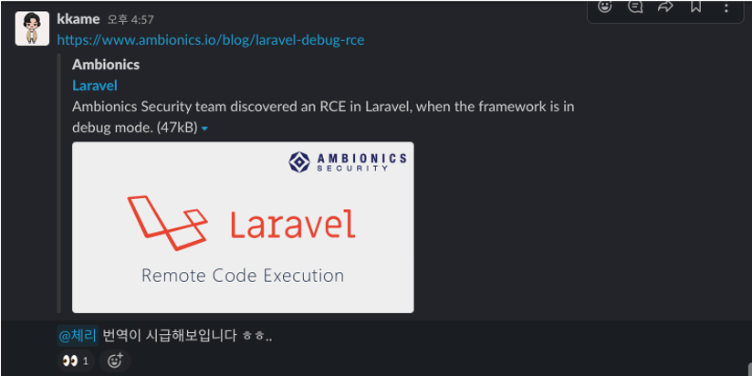

> [원본글 - New Laravel Route “Missing” Method](https://laravel-news.com/route-missing-method)

라라벨 v8.26.0 버전과 함께 출시하는 라우터는 새로운 `missing()` 메소드가 추가되어 없는 페이지를 편리하게 처리할 수 있는 새로운 방법을 제공합니다.

<blockquote class="twitter-tweet"><p lang="en" dir="ltr">A new Route::()...-&gt;missing() method ships in today&#39;s Laravel release. Contributed by <a href="https://twitter.com/hotmeteor?ref_src=twsrc%5Etfw">@hotmeteor</a> ... check out the docs here! <a href="https://t.co/gdhOAeJ3nS">https://t.co/gdhOAeJ3nS</a> 🔥</p>&mdash; Taylor Otwell 💎 (@taylorotwell) <a href="https://twitter.com/taylorotwell/status/1356611668424466434?ref_src=twsrc%5Etfw">February 2, 2021</a></blockquote> <script async src="https://platform.twitter.com/widgets.js" charset="utf-8"></script>

기본적으로 라우터 모델의 바인딩은 만약 없는 레코드에 접근한다면 404를 리턴하지만,  
여태까지는 이를 커스텀하거나, 원하는 방법으로 처리하고자하면, 따로 정의가 필요합니다.  
하지만 `missing()` 메소드를 사용하면 시나리오가 훨씬 간단해 집니다.

```php
Route::get('/locations/{location:slug}', [LocationsController::class, 'show'])
    ->name('locations.view')
    ->missing(function (Request $request) {
        return Redirect::route('locations.index');
    });
```

이 `missing()` 메소드는 라우터 캐싱과 함께 작동하며, 라우트 모델 바인딩의 `ModelNotFound`예외가 발생할 때, 원하는 방식으로 정의하면 됩니다.

Laravel을 사용하는 것을 매우 즐겁게 만드는 것은 이와 같은 기능입니다. 이 기능에 기여한 [Adam Campbell](https://github.com/hotmeteor)에게 박수를 보냅니다!

# 마치며

저번 쿼리 바인딩 분석때 진짜 없는시간 쪼개가면서 작업해서 그런지 번아웃이 온 것 같았네요ㅎㅎ  
여전히 바쁘지만 그래도 앞으로 다양한 내용을 정리해서 올리고 싶네요!
<br/>
<br/>
<br/>

<figcaption>다음글..?</figcaption>