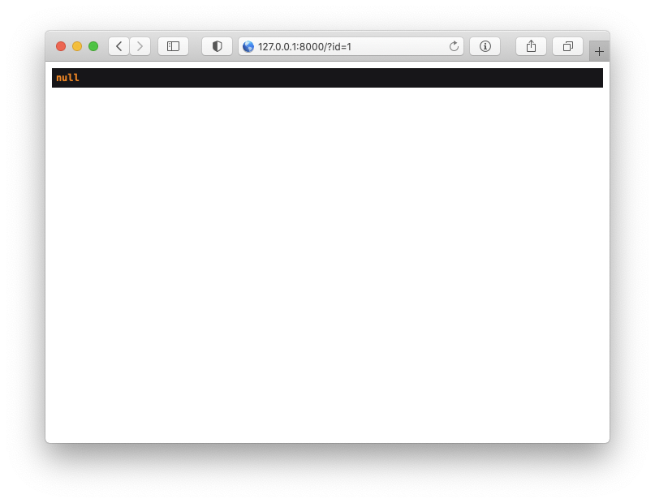

> `6.20.11`, `7.30.2`, `8.22.1` 보안 패치 이후, 유사한 방법으로 취약점이 발생해 `6.20.14`, `7.30.4`, `8.24.0` 이상 버전으로 업데이트하기를 권고드립니다.

> <h1><a href="#이게-대체-으떻게-된-일입니까">TL;TR</a></h1>

이번 글에선 2021년 1월 13일과 1월 21일에 걸쳐 발표된 [CVE-2021-21263](https://cve.mitre.org/cgi-bin/cvename.cgi?name=CVE-2021-21263), [CVE-2021-3129](https://cve.mitre.org/cgi-bin/cvename.cgi?name=CVE-2021-3129) 취약점들에 대해서 알아보겠습니다.

> CVE란? Common Vulnerabilities and Exposures의 약자로 알려진 취약점의 번호를 매겨 관리하고, 내용을 공유할 수 있도록 만들어진 취약점에 대한 고유 번호입니다. (유명한 인텔의 `멜트다운 취약점` 또한 `CVE-2017-5754`라는 번호가 부여되어 있습니다.)

# 선행 지식

## Array 파라미터
PHP에선 파라미터를 배열로 전달 할 수 있습니다. 예를들어 `[1, 2, 3]`와 같은 배열을 리퀘스트로 전달 하고 싶다면, `?val[]=1&val[]=2&val[]=3`이와 GET 파마리터로 전달하면, `$_GET['val']`에 `[1, 2, 3]`배열이 전달되게 되어집니다.

## Query binding
PHP에서 SQL을 사용해 데이터페이스에 접근할 때 기존에는 직접 SQL쿼리를 작성하여 가져왔습니다.
```php
mysql_query("SELECT * FROM users WHERE id = " . $id);
```
하지만 이와 같은 방법은 SQL injection과 같은 취약점을 발생 시키기에 많은 필터링과 입력값에 대한 사전 검증이 많이 필요합니다.

이에 대한 문제를 해결하고자 [`prepare-statement`](https://en.wikipedia.org/wiki/Prepared_statement)기법을 이용합니다.
```php
$statement = $connection->prepare('SELECT * FROM users WHERE id = ?');
$statement->bindValue(0, 1, PDO::PARAM_INT);
$statement->execute();
```
위처럼 입력된 곳을 `?` 혹은 `:id`등과 같이 `쿼리`를 미리 준비(prepare)해두고 해당 위치에 들어갈 `데이터`를 바인드(bind)해 SQL injection 으로 부터 안전하게 사용할 수 잇는 방법입니다.

> 왜 안전한지는 추후 따로 다뤄보겠습니다만, 간단히 설명하면 쿼리를 "준비"후 데이터를 "bind"하기 때문인데, 즉 "쿼리"와 "데이터"가 각각 DB로 보내져서 따로 처리되기 때문입니다.

# Vulnerability Description
이번에 발생한 `CVE-2021-21263`와 `CVE-2021-3129`모두 Laravel의 ORM에서 쿼리를 바인딩 할때 발생하는 문제입니다.

예를 들어, User 테이블에 다음과 같은 DB가 구성되어 있고,
|id|name|email|is_admin|
|:--:|:--:|:---:|:------:|
|1|admin|admin@email.com|1|
|2|user|user@email.com|0|

아래와 같은 라우트가 있을 때,
```php
Route::get('/', function () {
    $id = request()->id;
    $user = User::where('id', $id)->where('is_admin', 0)->first();
    return $user->name ?? 'null';
});
```
다음과 같은 결과가 나오게 됩니다.


<figcaption>http://127.0.0.1:8000/?id=1</figcaption>

이때 `?id[]=1&id[]=1`이렇게 리퀘스트해 `[1, 1]` 배열을 전달하게 되면 신기한 일이 생깁니다.

![http://127.0.0.1:8000/?id[]=1&id[]=1](img/id=1-array.png)
<figcaption>http://127.0.0.1:8000/?id[]=1&id[]=1</figcaption>

# 이게 대체 으-띃게 된 일입니까??

## TL;TR

`?id[]=1&id[]=1`으로 요청이 들어왔을 때 `User::where('id', $id)->where('is_admin', 0)->dump()`를 통해 쿼리와 데이터를 확인해보면 다음과 같습니다.

SQL: `` select * from `users` where `id` = ? and `is_admin` = ? ``  
Bindings: `[0 => 1, 1 => 1, 2 => 0]`

Laravel에선 value로 Array를 전달 받았을 이를 destructing 한 후 순서대로 `?`에 바인딩 하는데,  
이때 앞에 value가 뒤의 value를 덮어 씌우게 되며(혹은 밀어내며),  
`` select * from `users` where `id` = 1 and `is_admin` = 1 `` 위와 같은 쿼리가 만들어지게 됩니다.

> 다만, 이때 마지막 `2 => 0` 부분이 남기 때문엔 SQLite 에선 필요한 값의 개수와 바인딩 되는 데이터의 개수가 다르기 때문에 SQL에러가 발생합니다.

## Detail

Laravel의 쿼리에 데이터를 바인딩하는 부분을 살펴 보면 이유를 알 수 있습니다.

```php
/** src/Illuminate/Database/Query/Builder.php:3130 (8.22.0) */

    /**
     * Add a binding to the query.
     *
     * @param  mixed  $value
     * @param  string  $type
     * @return $this
     *
     * @throws \InvalidArgumentException
     */
    public function addBinding($value, $type = 'where')
    {
        if (! array_key_exists($type, $this->bindings)) {
            throw new InvalidArgumentException("Invalid binding type: {$type}.");
        }

        if (is_array($value)) {
            $this->bindings[$type] = array_values(array_merge($this->bindings[$type], $value));
        } else {
            $this->bindings[$type][] = $value;
        }

        return $this;
    }
```

Laravel에선 `where('id', $id)->where('is_admin', 0)`와 같이 쿼리를 빌딩하게 되면 `$type`에는 `where`, `join`과 같은 구분이,  
그리고 `$value`에는 그 데이터 들을 `$this->bindings[$type]`에 각각 저장 해 놓습니다.  
만약, `?id=1` 일 때 `$this->bindings['where'] = [1, 0]` 이런 식으로 저장되게 됩니다.

이후 실제 쿼리를 실행할 때 아래의 부분에서 데이터를 순차적으로 쿼리와 바인딩 시킵니다.

```php
/** src/Illuminate/Database/Connection.php:576 (8.22.0) */

    /**
     * Bind values to their parameters in the given statement.
     *
     * @param  \PDOStatement  $statement
     * @param  array  $bindings
     * @return void
     */
    public function bindValues($statement, $bindings)
    {
        foreach ($bindings as $key => $value) {
            $statement->bindValue(
                is_string($key) ? $key : $key + 1,
                $value,
                is_int($value) ? PDO::PARAM_INT : PDO::PARAM_STR
            );
        }
    }
```

`id=1`과 같이 정상적일 때는 `$bindings`의 값이 `[0 => 1, 1 => 0]`으로 전달되어 순서대로 바인딩 되는 것을 보실 수 있습니다.

하지만 여기서 `id[]=1&id[]=1`과 같이 배열이 전달 되게 된다면, `addBinding()` 메소드가 순서대로 `[0 => 1, 1 => 1, 2 => 0]`와 같은 바인딩 값을 전달 하고, `bindValues()` 메소드에 의해 쿼리에 앞에서 부터 순서대로 `id = 1`, `is_admin = 1` 이 들어가게 되고 기존의 마지막 `2 => 0` 값은 무시되어지게 됩니다.

# 패치내역

## CVE-2021-21263 (`6.20.11`, `7.30.2`, `8.22.1` 보안 패치)
```php
/** src/Illuminate/Database/Query/Builder.php */
    // Before
    if (! $value instanceof Expression) {
        $this->addBinding($value, 'where');
    }

    // after
    if (! $value instanceof Expression) {
        $this->addBinding(is_array($value) ? head($value) : $value, 'where');
    }
```

이번 취약점의 경우 바인딩 되어지는 값이 배열일 경우 생겨지는 문제로 인해 발생하기에, 바인딩 되어지는 value가 배열일 경우엔 `head` helper 함수를 이용해 제일 처음 것만 가져오는 방식으로 패치 되었습니다. [ [v8.22.0...v8.22.1](https://github.com/laravel/framework/compare/v8.22.0...v8.22.1) ]

## CVE-2021-3129 (`6.20.14`, `7.30.4`, `8.24.0` 보안 패치)

하지만, 위의 패치는 우회되어 똑같이 이슈가 생기게 되는 불상사가 일어납니다.  
키포인트는 위에서 패치방법인 `제일 처음 것만 가져오는` 이 문제가 됩니다.

결국 value의 처음것만 가져오기에 `id[0][]=1&id[0][]=1` 이렇게 배열의 첫번째 값에 Array 넣게 되면 동일한 이슈가 발생하게 됩니다.

```php
/** src/Illuminate/Database/Query/Builder.php */
    // New method
    protected function flattenValue($value)
    {
        return is_array($value) ? head(Arr::flatten($value)) : $value;
    }

    // Before
    if (! $value instanceof Expression) {
        $this->addBinding(is_array($value) ? head($value) : $value, 'where');
    }

    // after
    if (! $value instanceof Expression) {
        $this->addBinding($this->flattenValue($value), 'where');
    }
```

이를 패치하기위해 위의 `처음의 값만 가져오는 것`과 `flattenValue()`메소드를 만들어 배열을 flatten하게(?) 변경하도록 패치되었습니다. [ [v8.23.1...v8.24.0](https://github.com/laravel/framework/compare/v8.23.1...v8.24.0) ]

# 마치며

Laravel의 취약점 중에서 가장 많이 사용하고 있었던 곳이 아닐까 싶습니다.  
매일 ->where 을 수십번은 넘게 쓰고 있었는데 이런 취약점이 터질줄은 ... 상상도 못했네요.

23일쯔음에 Laravel에서 연속적으로 CVE가 나오는 걸보고 흔치 않다고 생각해서 '아 분석배봐야지' 라고 마음 먹고 취약점을 분석하고, 글 작성하는데 거의 이틀 가까이 걸렸네요.

참고로 이 취약점은 `Validator`를 이용해 `'string'`으로 타입 체크를 해주시고 있었다면, 터지지 않는 취약접입니다. 제가 짤 때는 기본적으로 모든 입력값에 대해선 검증을 하기에 크게 수정이 필요한 부분은 없었네요.

그리고 예전에 제가 찾은 [7.x XSS 분석 글](https://blog.silnex.kr/패치됨-laravel-7-x-xss-vulnerability/)도 있으니 관심 있으시면 같이 보셔도 좋습니다 ㅎㅎ